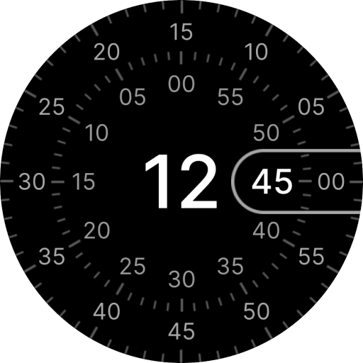

# Concentric — Wear OS Watch Face



A Wear OS watch face inspired by the Concentric design of the original Google Pixel Watch, built entirely with the declarative [Watch Face Format](https://developer.android.com/training/wearables/wff) (WFF v4) — no Java/Kotlin, just XML.

It began as a fork of [lukakilic/concentric-watch-face](https://github.com/lukakilic/concentric-watch-face) and has since grown into an independently maintained project that extends the original with:

- **Complications** — added `GOAL_PROGRESS` and `WEIGHTED_ELEMENTS` support and a custom range indicator that correctly maps `RANGED_VALUE` complications whose bounds aren't 0–100, and reworked the left-edge pill slot to sit symmetrically. Five slots in total: four corner arcs plus the left pill.
- **Colors** — rebuilt the palette around Material Design 3 colors and the four-role color model of Google's original Concentric face (digits, indices, bars, icons), with preset flavors on top.
- **AOD** — added subtle ambient animations and new graphics that more closely resemble the original always-on display.
- **Settings** — redesigned the watch face editor configuration.
- **CI pipeline** — lints, builds, validates the WFF XML, and evaluates the memory footprint on every push.

Requires Wear OS 6 or newer (WFF v4).

## Modify the watch face

The whole watch face is XML under `app/src/main/res/`:

- `raw/watchface.xml` — the full scene graph: user configuration (colors, modes, AOD) and every visual element.
- `xml/watch_face_info.xml`, `xml/watch_face_shapes.xml` — WFF metadata and the 450×450 circular shape binding.

Watch Face Format is well [documented](https://developer.android.com/training/wearables/wff/watch-face) — pin the docs to `?version=4` to match the manifest. See [`CLAUDE.md`](CLAUDE.md) for an architecture tour and the project conventions.

## Build the watch face

```sh
./gradlew :app:assembleDebug      # build a debug APK
./gradlew :app:installDebug       # install to a connected Wear OS 6 device/emulator
```

Every push and pull request runs [`.github/workflows/checks.yml`](.github/workflows/checks.yml), which lints, assembles the APK, validates the WFF XML with Google's validator, and evaluates the memory footprint. Run the validator locally the same way CI does (it exits `0` even on failure, so check the log for `PASSED`/`FAILED`):

```sh
java -jar app/libs/wff-validator.jar 4 app/src/main/res/raw/watchface.xml
```

For more background on building WFF watch faces, see [wear-os-samples/WatchFaceFormat](https://github.com/android/wear-os-samples/tree/main/WatchFaceFormat).

## Credits & license

- **Original project**: [Concentric watch face](https://github.com/lukakilic/concentric-watch-face) by [Luka Kilic](https://github.com/lukakilic), released under the MIT License. This project would not exist without it.
- **Design**: the Concentric visual design originates from Google's Pixel Watch. This is an independent recreation, not affiliated with or endorsed by Google.
- **Fonts**: [Inter](https://rsms.me/inter/) (SIL Open Font License 1.1), Roboto and Roboto Mono (Apache License 2.0).
- This project is released under the [MIT License](LICENSE).
